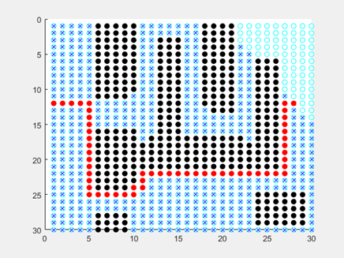
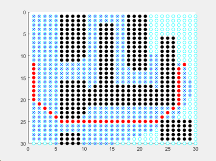
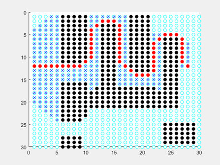
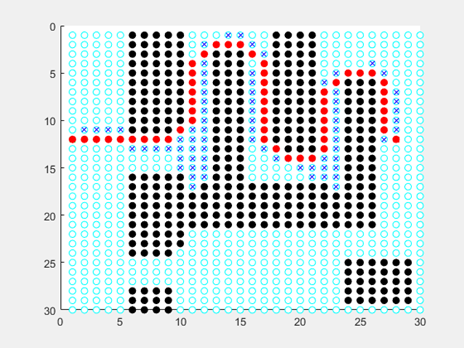
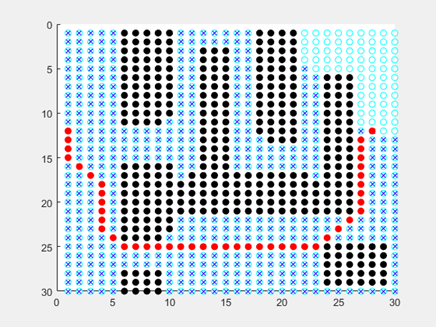
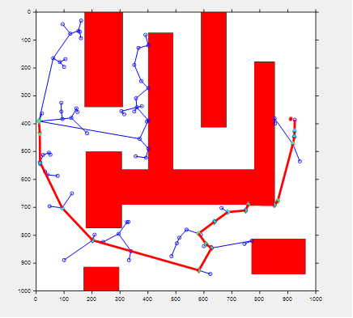
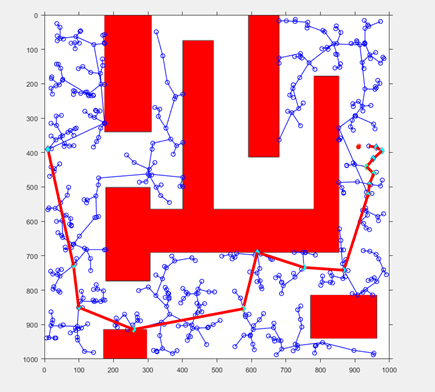
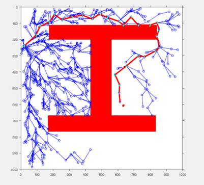
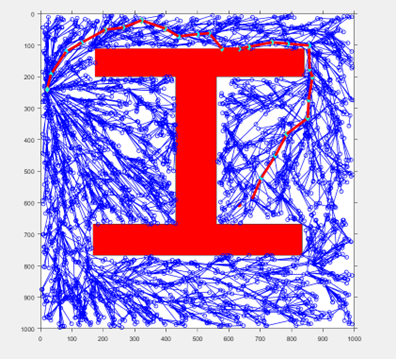

# Comparison of Different Path Planning Algorithms

🧭
An intiutive MATLAB based implementation of popular traditional grid-based and search-based path planning algorithms 
🧭

📍 This work has been developed during Autonomous Vehicles master's course in PoliMi under the guidance of Francesco Braghin. For any questions and/or contributions feel free to get in touch! 

## Dijkstra's Algorithm

📍Evaluates shortest distance to the start amongst every neighbour at each iteration (cost-to-go):

$$
q = min[C(q)]
$$

where $C(q)$ is the cost to arrive at node $q$ at each iteration.

  

  

## A*

📍Evaluates shortest distance with heuristic additional amongst every neighbout at each iteration (cost-to-go + cost-to-arrive estimation)

$$
q = min[C_{1}(q) + C_{2}(q)]
$$

where $C_{1}(q)$ is the cost to arrive and $C_{2}(q) is the cost to go heuristic$ at node $q$ at each iteration.

{: style="width100px"}
{: style="width100px"}

{: style="width100px"}

## RRT

📍Evaluates admissable space configurations on a random sampling basis, hence the name rapidly exploring random trees - RRT.

{: style="width100px"}
{: style="width100px"}

## RRT*

📍Evaluates and updates on each iteration possible links based on an heuristic optimization rule allowing for the stochaisticity to be minimalized.

{: style="width100px"}
{: style="width100px"}
# Scripts

The results presented are obtained on a modern CPU. Any Intel/AMD configuration that is from the last 10 years should suffice.

Apart from the proprietary software (MATLAB), there are no other software requirements.

# Maps

It is possible to create custom maps. For this purpose any Microsoft Paint based implementation should suffice where the initial (green), final (red) and obstacle (black) points are clearly identifiable.

Note that the exact pixel locations may not be perfectly identified due to the blurring effects in MS Paint and the implemented color mask.

# Commands

It is possible to run each path finding algorithm referring to its main file and running it through the MATLAB compiler. For example, in order to find sub-optimal paths on a given map using A*, it is enough to navigate to the script

    main_Astar.m

and compile.